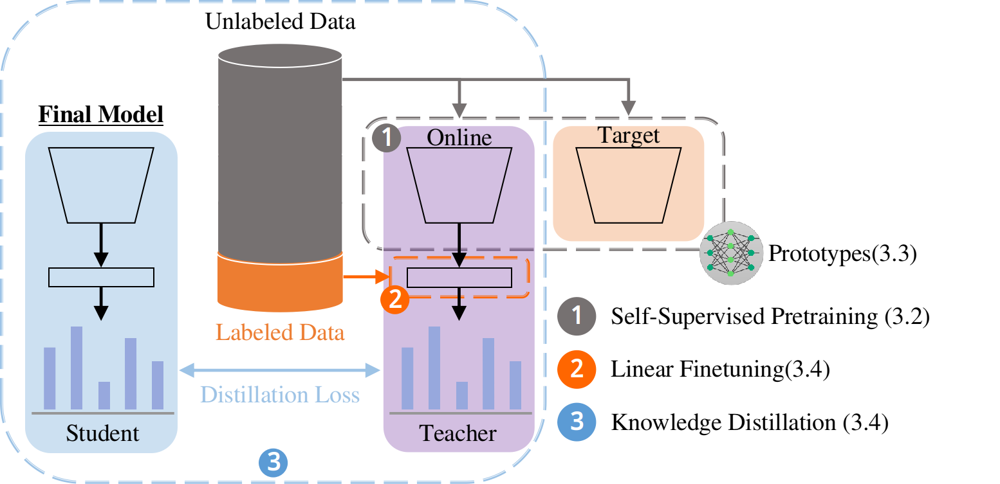
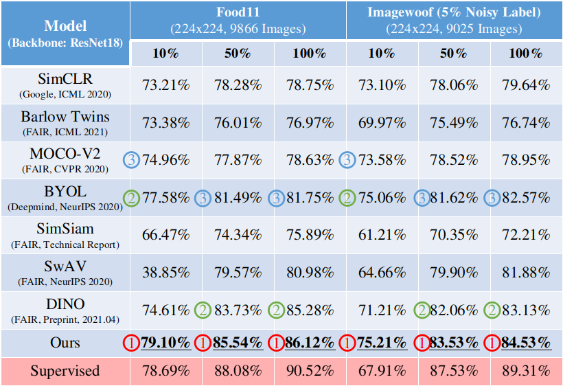
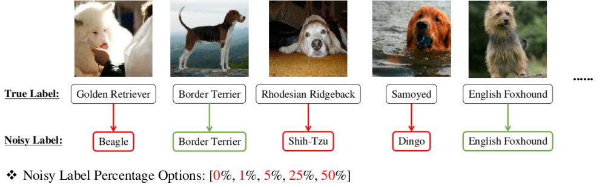
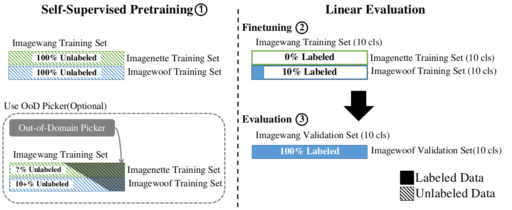

# Semi-Supervised Framework

## Description
A systematic end-to-end semi-supervised framework aims to leverage both labeled and unlabeled data to improve model performance.


## Prerequisites
- How to use [`hydra`](https://hydra.cc/docs/intro/) (configs management tool)
- How to use [`wandb`](https://wandb.ai/site) (powerful online log service)

## Quick start: sanity check
```shell=
git clone https://git.dataarch.myds.me/shortcake/semi-supervised-framework
cd semi-supervised-framework
mkdir -p ./log/wandb

# Prepare virtual env
# We recommeneded python3.7, or you can use the python3 on your system(untested)
pip install pipenv
pipenv install --python $(which python3)
pipenv shell

# Optional login to wandb online log server
# Or select "(3) Don't visualize my results" on the beginning of each run
wandb login

# Training command
# For instance a sanity test:
python3 main.py --config-name simclr `# <-- Check model options` \
        datamodule=cifar10 `# <-- Check dataset options` \
        'datamodule.basic.base_dir="/dev/shm"' \
        model=resnet18 \
        basic.device_batch_size=256 \
        basic.num_gpus=1 \
        model.basic.eff_batch_size=256 \
        +trainer.fast_dev_run=True
```

## Model options (./configs/* for model-specifc configs)
- SimCLR (simclr)
- MoCo-V2 (moco)
- BarlowTwins (barlow_twins)
- BYOL (byol)
- SimSiam (simsiam)
- SwAV (swav)
- DINO (dino)
- SimEstimator[ours] (sim_estimator)


## Dataset options
### Option 1: prebuilt datasets (reader function ready)
- [Cifar10](https://www.cs.toronto.edu/~kriz/cifar.html)
- [Food11](https://www.kaggle.com/vermaavi/food11)
- [Food101](https://www.kaggle.com/dansbecker/food-101)
- [Stanford Dogs](http://vision.stanford.edu/aditya86/ImageNetDogs/main.html)
- [Caltech101](http://www.vision.caltech.edu/Image_Datasets/Caltech101/)
- [Imagenette](https://github.com/fastai/imagenette#imagenette)
- [Imagewoof](https://github.com/fastai/imagenette#imagewoof)
- [Imagewang](https://github.com/fastai/imagenette#image%E7%BD%91)
- [Diabetic retinopathy detection](https://www.kaggle.com/c/diabetic-retinopathy-detection)

### Option 2: use your own dataset
- Customize your reader function in `./dataset/dataset_reader.py`
```python=
# Reader function signature
def customize_reader(
    data_dir: str,
    is_train: bool,
    **kwargs,
    ) -> Tuple[list, list, list]:
    """
    Access the dataset
    """

    return image_list, label_list, class_names
```
- Test if `customize_reader(...)` access your dataset correctly
```shell=
# Append _show_fn("your_dataset_name", customize_reader) in main in dataset_reader.py
# Execute the following command to check sample number in each set
python3 -m dataset.dataset_reader
```

### Miscs options: Dataset-specific parameter
- Label noise (Imagewoof)
```shell=
python3 main
python3 main.py --config-name simclr \
        datamodule=imagewoof \
        `# Apply 5% label noise, other options: [0, 1, 25, 50]` \
        +datamodule.data_module.noise_percent=5 \
        `# other configs`
```

- Domain noise (Imagewang)
```shell=
# See ./ood_picker/README.md: how to dump ood_file.txt (ood samples which should be filtered)
python3 main.py --config-name simclr \
        datamodule=imagewang \
        `# Apply out-of-domain data filter
        '+datamodule.data_module.ood_file="./ood_picker/ood_file.txt"'
        `# other configs`
```


## Training command (three phase training)
### 1. Self-supervised pretraining
```shell=
# The well-trained checkpoint will be saved in "./log/wandb_ckpt/SSL_Lab/{config-name}_{model}_{datamodule}_{datamodule.basic.ratio}_{basic.log_postfix}/checkpoints/"
# In this case is: "./log/wandb_ckpt/SSL_Lab/simclr_resnet50_food11_ratio1.0_test/checkpoints/"
python3 main.py --config-name simclr `# Use the config names in ./configs` \
        datamodule=food11 `# Folder name of your dataset. Also a reader function should be defined in ./dataset/dataset_reader.py` \
        'datamodule.basic.base_dir="/dev/shm"' `# Path to the root dir of your dataset` \
        datamodule.basic.ratio=1.0 `# All available unlabeled training data` \
        model=resnet50 `# We only offer ResNet18/ResNet50` \
        basic.device_batch_size=64 `# Batch size on a single GPU` \
        basic.num_gpus=1 \
        model.basic.eff_batch_size=256 `# Total batch size` \
        basic.log_postfix="test" `# Postfix for your checkpoint folder`
```

### 2. Linear fine-tuning
```shell=
# Use the pretrained weights from self-supervised phase
# The fine-tuned weights will be saved in "log/wandb_ckpt/SSL_Lab/{config-name}_{model}_{datamodule}_{datamodule.basic.ratio(in pretraining)}_{basic.log_postfix}_linear_eval_{datamodule.basic.ratio(in fine-tuning)}/checkpoints/"
# In this case is: "log/wandb_ckpt/SSL_Lab/simclr_resnet50_food11_ratio1.0_test_linear_eval_ratio0.1/checkpoints/"
python3 main.py --config-name simclr \
        datamodule=food11 \
        datamodule.basic.ratio=0.1 `# Available labeled data for fine-tuning` \
        model=resnet50 \
        basic.device_batch_size=256 \
        trainer=linear_eval `# Specify the linear fine-tuning phase` \
        'basic.pretrained="log/wandb_ckpt/SSL_Lab/simclr_resnet50_food11_ratio1.0_test/checkpoints/simclr-resnet50-food11-epoch=00799-step=35199.ckpt"' \
        basic.num_gpus=1
```

### 3. Knowledge distillation
```shell=
# Use the fine-tuned weights from linear fine-tuning phase
# The final weights will be saved in "log/wandb_ckpt/SSL_Lab/{config-name}_{model}_{datamodule}_{datamodule.basic.ratio(in pretraining)}_{basic.log_postfix}_linear_eval_{datamodule.basic.ratio(in fine-tuning)}_self_train_{datamodule.basic.ratio(in distillation)}/checkpoints/"
# In this case is: "log/wandb_ckpt/SSL_Lab/simclr_resnet50_food11_ratio1.0_test_linear_eval_ratio0.1_self_train_ratio0.1/checkpoints/"
python3 main.py --config-name simclr \
        datamodule=food11 \
        datamodule.basic.ratio=1.0 `# Use full unlabeled dataset to distill knowledge from teacher model to student model` \
        model=resnet50 `# Teacher model size` \
        basic.device_batch_size=256 \
        trainer=self_train \
        'basic.pretrained="log/wandb_ckpt/SSL_Lab/simclr_resnet50_food11_ratio1.0_test_linear_eval/checkpoints/simclr-resnet50-food11-epoch=00089-step=15839-supervised_val_acc=0.919.ckpt"' \
        basic.num_gpus=1 \
        basic.num_workers="1 * 16" \
        model.basic.student_size=resnet18 \
        model.basic.eff_batch_size=256
```

### Miscs: supervised training
```shell=
# Apply typical supervised training
# The final weights will be saved in "log/wandb_ckpt/SSL_Lab/supervised_{model}_{datamodule}_{datamodule.basic.ratio(in supervised training)}_{basic.log_postfix}/checkpoints/"
# In this case is: "log/wandb_ckpt/SSL_Lab/supervised_resnet50_food11_ratio1.0_test/checkpoints/"
python3 main.py --config-name simclr `# self-supervised model configs does not matter here, since we use supervised trainer` \
        datamodule=food11 \
        datamodule.basic.ratio=1.0 `# Use full labeled dataset to train a supervised model` \
        model=resnet50 \
        basic.device_batch_size=256 \
        trainer=supervised `# Apply supervised training instead of self-supervised pretraining` \
        basic.num_gpus=1 \
        basic.num_workers="1 * 16" \
        model.basic.eff_batch_size=256 \
        basic.log_postfix="test"
```


## Folder structure
```shell=
.
├── arch (code for backbone & algorithm definitions)
│   ├── models
│   └── modules
├── callbacks (helper hook functions)
│   └── custom_callbacks.py
├── configs ( general configs(common) and model-specific configs(others) )
│   ├── barlow_twins
│   ├── byol
│   ├── common
│   ├── dino
│   ├── moco
│   ├── simclr
│   ├── sim_estimator
│   ├── simsiam
│   └── swav
├── dataset (reader functions, transform functions, pytorch dataset wrapper, and lightning datamodule wrapper)
│   ├── data_module.py
│   ├── dataset_reader.py
│   ├── random_access_dataset.py
│   └── ssl_augmentation.py
├── loss (some model-specific losses)
│   ├── memory_bank.py
│   ├── multi_crop_wrapper.py
│   ├── nt_xent_loss.py
│   └── soft_xent_loss.py
├── main.py
├── README.md
├── requirements.txt
└── utils (code for some hydra config parsing usages)
    └── config_utils.py
```

## Disclaimer
- Our project is based on:
    - [pl-bolts](https://github.com/PyTorchLightning/lightning-bolts)
    - [lightly-ai](https://github.com/lightly-ai/lightly)
    - And the implementations from original papers
- Reference paper
    - Ting Chen et al., "A Simple Framework for Contrastive Learning of Visual Representations," In International Conference on Machine Learning, 2020.
    - Ting Chen et al., "Big Self-Supervised Models are Strong Semi-Supervised Learners," In Advances in Neural Information Processing Systems, 2020.
    - Jean-Bastien Grill et al., "Bootstrap your own latent: A new approach to self-supervised Learning," In Advances in Neural Information Processing Systems, 2020.
    - Kaiming He et al., "Momentum Contrast for Unsupervised Visual Representation Learning," In Proceedings of the IEEE Conference on Computer Vision and Pattern Recognition, 2020.
    - Xinlei Chen et al., "Improved Baselines with Momentum Contrastive Learning," arXiv preprint arXiv:2003.04297, 2020.
    - Jure Zbontar et al., "Barlow Twins: Self-Supervised Learning via Redundancy Reduction," In International Conference on Machine Learning, 2021.
    - Xinlei Chen, and Kaiming He, "Exploring Simple Siamese Representation Learning," arXiv preprint arXiv: 2011.10566, 2020.
    - Mathilde Caron et al., "Unsupervised Learning of Visual Features by Contrasting Cluster Assignments," In Advances in Neural Information Processing Systems, 2020.
    - Mathilde Caron et al., "Emerging Properties in Self-Supervised Vision Transformers," arXiv preprint arXiv: 2104.14294, 2021.
